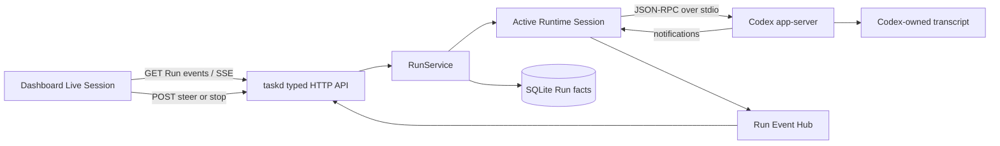
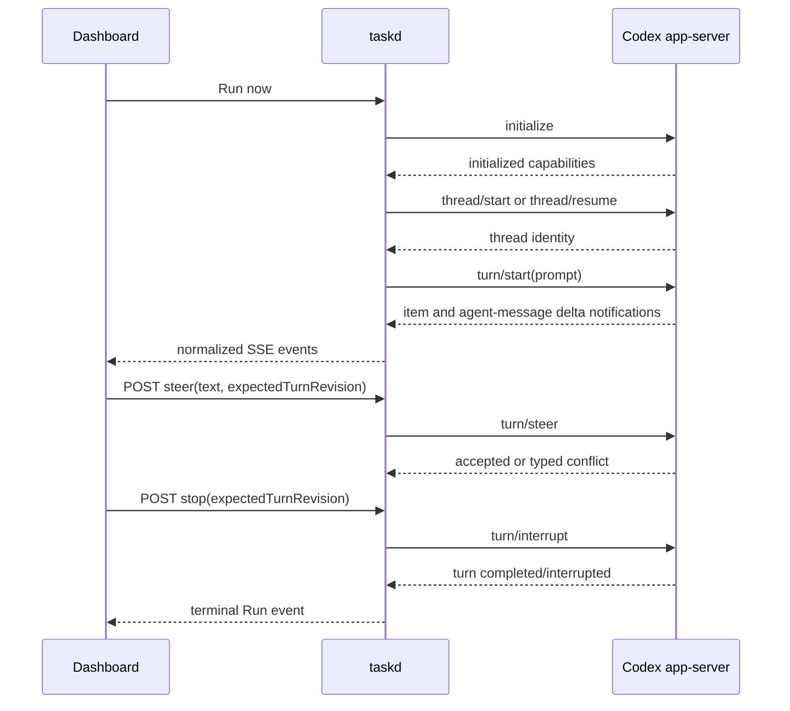

# Dashboard Live Session Control Design

**Date:** 2026-08-27

**Status:** Approved direction; implementation pending

**Scope:** Connect an active Scheduled Run to Dashboard in real time and allow bounded intervention in the current Codex Turn.

## Summary

Tasks Recorder will add a Live Session surface for active Runs. The Dashboard will display normalized assistant deltas and compact activity events as they happen, accept an additional user instruction for the currently running Turn, and allow the user to stop that Turn.

The implementation uses Codex's native `app-server` protocol rather than attempting to make the one-shot `codex exec --json` process interactive. `taskd` owns one isolated `codex app-server --listen stdio://` process per active Run, performs the protocol handshake, starts or resumes a thread, starts a Turn, normalizes notifications into the existing bounded Run event stream, and translates typed Dashboard actions into `turn/steer` or `turn/interrupt` requests.

This phase intentionally ends at the terminal Run boundary. A completed Run continues to use the existing Terminal Resume action. Dashboard-native follow-up Turns and cross-Run conversation lineage are not part of this change.

## First-principles model

### Goal

Let a user observe what an active local agent is doing and correct its direction without leaving Tasks Recorder.

### Facts

- the existing Run-specific SSE endpoint already provides a bounded, reconnectable transport;
- the current `codex exec --json` child receives one prompt and closes stdin, so it cannot accept a later instruction;
- Codex `app-server` exposes typed `thread/start`, `thread/resume`, `turn/start`, `turn/steer`, and `turn/interrupt` methods;
- `AgentMessageDeltaNotification` carries actual assistant deltas with `threadId`, `turnId`, and `itemId`;
- Codex may reject steering when the active Turn is temporarily non-steerable;
- taskd already owns Runtime resolution, Run lifecycle, event buffering, persistence, and cancellation;
- Tasks Recorder's privacy contract forbids persisting prompt, reasoning, tool payload, assistant message, or transcript content in SQLite.

### Constraints

- the browser sends semantic Run IDs, taskd Turn revision, and bounded text only; it never submits executable paths, argv, shell commands, Workspace, session IDs, or runtime Turn IDs;
- all protocol processes use `shell: false` and the same Runtime Environment as model discovery and Run launch;
- the daemon validates that a requested Run is active and owns the referenced protocol session;
- intervention is optimistic and Turn-scoped: taskd exposes a monotonic public `turnRevision`, while the runtime's real `turnId` remains private to the driver; the Codex `threadId` continues through the existing public `session_id` contract for copy and Terminal Resume but is never accepted as control authority from the browser; stale or non-steerable requests return typed conflicts instead of silently starting another Turn;
- event buffers, input size, process shutdown, reconnect, and protocol requests remain bounded;
- a disconnected Dashboard must not stop or corrupt the Run;
- transcript content remains ephemeral in taskd memory and Codex-owned session storage.

### Success criteria

- an active Run streams assistant text incrementally without polling;
- command, tool, file-change, session, and lifecycle activity appears in chronological order;
- sending guidance while the Turn is steerable affects that same active Turn;
- a stale, completed, unavailable, or non-steerable Turn produces a specific recoverable error;
- Stop interrupts the Turn and converges the Run to a terminal state;
- reconnect resumes from the last SSE sequence, and an expired buffer produces a deterministic detail/log fallback;
- two browser clients cannot steer an old Turn accidentally;
- existing scheduled/manual Run creation, terminal Resume, Run history, and non-interactive runtimes continue to work;
- desktop and mobile Live Session states pass Playwright visual verification.

## Johari review

### Open area

- Tasks Recorder already has the correct control-plane owner: `taskd`.
- Codex exposes a protocol intended for interactive clients.
- SSE is sufficient for the server-to-browser direction; no WebSocket is required for user actions.
- intervention targets only an active Turn in this phase.

### Hidden area

- provider-side authentication and account policy remain owned by the installed Codex CLI;
- whether a particular model or tool makes a Turn temporarily non-steerable is runtime state, not a Dashboard policy;
- the user may later want complete Dashboard-native multi-turn chat, but that requires an explicit product decision about Run identity and history.

### Blind spots

- replaying raw assistant content after taskd restart would violate the current no-transcript-persistence invariant unless a separate opt-in transcript store is designed;
- approvals requested by Codex app-server are not equivalent to steering. Scheduled Runs currently use unattended policy, so approval UI is excluded rather than half-implemented;
- a shared, long-lived app-server would reduce process count but would couple failures and complicate ownership, shutdown, and upgrade semantics.

### Unknown area and validation

- protocol compatibility across installed Codex versions: validate capabilities during handshake and return `runtime_protocol_unavailable` when unsupported;
- exact notification ordering around interruption: cover with protocol fixture tests and a real local Run;
- activity payload shapes for new Codex items: preserve unknown notifications as bounded generic activity rather than dropping the session;
- visual density of streaming activity: validate long text, rapid events, errors, reconnect, and narrow viewport through `playwright-headless`.

## Target architecture



### Ownership boundaries

| Component | Owns | Does not own |
| --- | --- | --- |
| Dashboard | presentation, reconnect cursor, user intent, public Session copy/Resume display | active runtime Turn identity, argv, shell, transcript persistence |
| HTTP API | validation, typed status/errors, auth boundary | Codex protocol state |
| RunService | active Run lookup, lifecycle, intervention authorization | JSON-RPC framing or Codex notification semantics |
| Codex interactive driver | handshake, thread/Turn methods, notification normalization | Schedule definitions, HTTP, SQLite |
| Run Event Hub | bounded ephemeral replay and live fan-out | durable transcript storage |
| Run store | lifecycle facts, session ID, summary, counts, result references | messages, prompt, reasoning, tool payloads |

## Runtime session contract

The registry gains an optional interactive capability instead of embedding Codex branches in RunService:

```js
interactiveSession: {
  create({ executable, environment, cwd, settings, signal, emit }),
}
```

The created session exposes behavior, not protocol details:

```js
{
  start({ prompt }),
  steer({ expectedTurnRevision, text }),
  interrupt({ expectedTurnRevision }),
  close(),
  completion,
}
```

Only adapters that implement this capability can expose Live intervention. Other runtimes continue through the existing one-shot process supervisor and show a read-only Run Review.

### Process isolation

Each interactive Run owns one app-server process. This is intentionally simpler than a shared daemon:

- Run and process have the same lifetime;
- crash, cancellation, output bounds, and cleanup are isolated;
- there is no global thread router or cross-Run head-of-line blocking;
- protocol upgrades cannot corrupt unrelated Runs;
- completed Runs release memory and process resources deterministically.

The process is started only after the durable Run enters the normal launch path. It is closed after the Turn reaches a terminal outcome or during bounded taskd shutdown.

## Protocol flow



The driver must complete `initialize` before thread methods. A new scheduled Run uses `thread/start`; a future continuation feature may use `thread/resume`, but this phase does not start follow-up Turns from Dashboard.

## Normalized events

Run SSE remains the public event transport. Interactive drivers emit a common envelope with the existing monotonic sequence:

```js
{
  seq,
  runId,
  type,
  timestamp,
  payload,
}
```

The Live Session consumes:

- `session_started`: public session identifier and runtime metadata;
- `turn_started`: taskd-generated `turnRevision` used only as an optimistic version token;
- `assistant_delta`: append-only visible text fragment;
- `activity_started` / `activity_completed`: bounded command, tool, or file activity summary;
- `usage_updated`: optional token/usage facts;
- `intervention_accepted`: acknowledgement for a matching Turn;
- `run_status`: queued, running, and terminal transitions;
- `stream_reset`: replay cursor is older than the retained buffer.

Reasoning content, raw tool payloads, approval secrets, environment values, and full protocol frames must never cross the Dashboard boundary.

### Replay behavior

The browser stores the latest event sequence in memory. Reconnect supplies that sequence. If Run Event Hub still retains newer events, it replays them and continues live. If the cursor predates retention, the server emits `stream_reset`; the UI clears ephemeral partial content, fetches durable Run detail, and offers the existing bounded log view. It must not fabricate a complete transcript.

## Control API

### Steer

```http
POST /api/v1/runs/:runId/steer
Content-Type: application/json

{
  "expectedTurnRevision": 1,
  "text": "bounded user guidance"
}
```

The API validates loopback authorization, JSON shape, non-empty text, a bounded UTF-8 byte length, active Run ownership, interactive capability, and the exact current taskd-managed Turn revision. Success returns `202` with a typed acknowledgement. It does not echo or persist the instruction.

Typed failures include:

- `RUN_NOT_ACTIVE` (`409`);
- `TURN_CHANGED` (`409`);
- `TURN_NOT_STEERABLE` (`409`);
- `RUNTIME_NOT_INTERACTIVE` (`409`);
- `RUNTIME_PROTOCOL_UNAVAILABLE` (`503`);
- `INTERVENTION_INVALID` (`400`).

### Stop

```http
POST /api/v1/runs/:runId/stop
Content-Type: application/json

{
  "expectedTurnRevision": 1
}
```

Stop maps to the interactive driver's Turn interrupt. Existing generic Run cancellation remains the fallback for one-shot runtimes. Repeated Stop is idempotent while interruption is in flight. Run finalization remains owned by RunService and must happen exactly once.

## Dashboard experience

Run Review becomes Live Session only when runtime capability and active Run state allow it.

### Layout

- header: Run title, runtime/model, current lifecycle state, elapsed time, reconnect indicator;
- stream: assistant message blocks and compact collapsible activity rows in chronological order;
- footer: sticky composer, keyboard hint, Send guidance, and Stop;
- completed state: final Run facts, files, logs, session ID, and existing Terminal Resume action.

The composer is disabled while connecting, after a terminal state, when no current Turn is known, or while the prior submission awaits acceptance. `Cmd+Enter` / `Ctrl+Enter` submits; plain Enter creates a newline. A rejected steer remains in the local composer and shows a contextual inline error, never a global alert or optimistic fake message.

### Visual principles

- streaming text is the primary content; operational activity is lower contrast and collapsible;
- no decorative status rails, micro-labels, or alert banners;
- running, reconnecting, accepted, rejected, and terminal states use consistent status semantics;
- the footer remains reachable without covering the last message;
- narrow screens use a full-height sheet with touch-safe controls and no horizontal overflow;
- reduced-motion preference removes animated streaming/reconnect decoration.

## Security and privacy

- existing loopback auth token protects both SSE and control requests;
- the server derives runtime, Workspace, session, thread, and Turn from the active Run;
- intervention text is never placed in URL, logs, SQLite, SSE acknowledgements, analytics, or error details;
- body size is rejected before parsing unbounded content;
- control requests use the exact taskd-generated `expectedTurnRevision` to prevent stale tabs from steering a later Turn without exposing runtime protocol identity;
- the driver redacts protocol errors before exposing them to UI;
- app-server stderr is treated as bounded diagnostic output, not visible conversation content.

## Failure handling

| Failure | Product behavior |
| --- | --- |
| app-server unsupported | Run fails with typed runtime protocol error; Dashboard remains available |
| app-server exits | RunService finalizes once and emits terminal status |
| SSE disconnects | Run continues; UI reconnects from last sequence |
| replay expired | UI receives reset and falls back to durable facts/logs |
| steer rejected | composer retains text and shows scoped retry guidance |
| stale Turn | client refreshes from stream; instruction is not applied |
| Stop timeout | generic bounded process termination completes cancellation |
| taskd restarts | open Run becomes interrupted under existing recovery policy; no transcript reconstruction claim |

## Testing strategy

### Unit and contract tests

- JSON-RPC framing, request correlation, notification parsing, protocol error mapping, and bounded shutdown;
- Codex notification normalization, including unknown item types;
- RunService active session ownership, expected Turn precondition, steer, interrupt, and finalize-once behavior;
- API request validation, auth, size limits, capability failures, and non-persistence of intervention text;
- SSE replay, reconnect, reset, and terminal retention;
- Live Session reducer, delta ordering, activity collapse, composer states, retry behavior, and keyboard submission.

### Integration tests

- fixture app-server: initialize → thread → Turn → delta → steer → completion;
- steer rejection and process crash;
- Stop during an active Turn;
- concurrent Dashboard clients with one stale expected Turn;
- existing one-shot runtime and Terminal Resume regression coverage;
- a real local Codex smoke Run when environment permits.

### Visual verification

Using the existing `playwright-headless` MCP server:

- desktop and mobile active streaming states;
- rapid mixed message/activity events;
- long Markdown/code content;
- reconnecting, steer rejected, stopped, succeeded, and failed states;
- sticky composer reachability, focus order, keyboard behavior, overflow, and reduced motion.

## Explicit non-goals

- Dashboard-native follow-up Turn after completion;
- durable transcript storage or transcript search;
- approval request UI;
- shared global app-server process;
- arbitrary shell input from Dashboard;
- retrofitting real-time message content for external Codex sessions observed only through hooks;
- implementing interactive drivers for runtimes other than Codex in this phase.

## Documentation impact

Implementation must update:

- `README.md`: Live Session behavior, privacy, supported runtime/version, and fallback;
- `docs/architecture.md`: optional interactive runtime capability and ephemeral transcript boundary;
- Scheduled Tasks maintenance/runbook documentation: protocol health checks, failure codes, and manual verification;
- API documentation if a dedicated endpoint reference exists.
