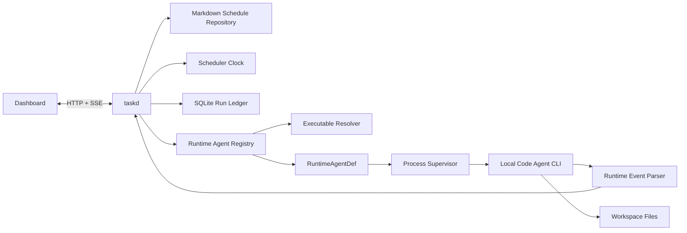

# Runtime Agent Registry and Single-Daemon Scheduler Design

**Date:** 2026-08-27

**Status:** Implemented on `feature/scheduled-tasks`; validation in progress

**Scope:** Replace the current Scheduled execution chain with an OpenDesign-style local runtime registry and a single `taskd` orchestration path.

## Summary

Tasks Recorder will use one long-lived local daemon, `taskd`, as the control plane for Schedule definitions, runtime discovery, Run lifecycle, Codex process supervision, durable Run facts, and Dashboard events.

The implementation will copy the proven mechanism used by OpenDesign:

- the browser talks only to a loopback daemon through HTTP and SSE;
- a runtime registry describes local code-agent CLIs;
- one shared resolver discovers and probes the executable used by both model discovery and real Runs;
- the daemon launches the already-installed and authenticated CLI with `shell: false`;
- runtime-specific output is normalized into a common event stream;
- the daemon owns cancellation, timeout, finalization, and persistence.

Tasks Recorder retains only one product-specific addition: durable Schedule semantics. Schedule definitions remain Markdown files, and `taskd` computes due occurrences using wall-clock time plus the Run ledger. The macOS LaunchAgent keeps `taskd` alive; it no longer creates one LaunchAgent and one runner process per Schedule.

The first delivered adapter is Codex. The registry contract is multi-CLI from the start so Claude Code, OpenCode, Cursor Agent, ACP runtimes, or other local agents can be added as definitions rather than new control planes.

## Evidence and context

The OpenDesign mechanism was evaluated at `nexu-io/open-design` commit `4076a7713556d9404123fb4b9c0b120cb24a7726`. Its relevant architecture is `Web → daemon → runtime registry → spawned CLI/ACP process`; executable resolution, model discovery, Run launch, stream parsing, cancel, resume, and persistence are centralized behind runtime definitions.

The current Tasks Recorder path is materially more complex:

```text
Dashboard
  → taskd HTTP API
  → manual dispatch ledger
  → launchctl kickstart
  → per-Schedule LaunchAgent
  → scheduled-runner Node process
  → runner lock
  → Unix socket claim
  → taskd Run creation
  → scheduled-runner reads config again
  → Codex child process
  → heartbeat / logs / completion evidence
  → Unix socket or spool replay
  → taskd SQLite
  → SSE invalidation
  → Dashboard refetch
```

Two observed failures demonstrate the cost of those boundaries:

1. a source Dashboard connected to an older installed `taskd`, so `/api/v1/schedules` returned `ROUTE_NOT_FOUND`;
2. a source `taskd` could execute the installed Codex CLI, but `codex_path: null` prevented creation of the model catalog and made `/api/v1/codex/models` disappear.

Both are architecture failures, not isolated UI defects. Runtime availability, model discovery, and real execution do not currently share one capability source.

## First-principles model

### Goal

Provide a local automation system whose behavior is easy to predict:

- one daemon;
- one runtime resolver;
- one Run lifecycle;
- one durable Run ledger;
- one browser event channel;
- one development command.

### Facts

- `taskd` is already installed as a macOS `launchd` KeepAlive service.
- `taskd` is already the sole SQLite writer and the loopback HTTP/SSE server.
- the local code-agent CLI owns its agent loop, authentication, tools, and provider access;
- Schedule definitions are now file-native Markdown;
- local Schedule cadence is minute-granularity;
- Codex exposes live model metadata through `codex debug models`;
- browser code must never construct or submit a shell command.

### Constraints

- v1 remains macOS-first because the service controller is macOS-only;
- CLI execution must use argument arrays with `shell: false`;
- probes must not run in the target project;
- the browser remains a semantic client, not a local process launcher;
- taskd restart, sleep/wake, duplicate ticks, and repeated HTTP requests must not create duplicate Runs;
- future runtime adapters must not require changes to Scheduler persistence or Dashboard Run lifecycle.

### Success criteria

- a locally installed Codex is discovered without installer-owned mandatory `codex_path` state;
- model discovery and Run launch use the same resolved executable;
- `Run now` persists a Run and returns its ID before process startup;
- the Dashboard observes `queued → running → terminal` through a common read model and SSE;
- scheduled and manual Runs use the same orchestrator;
- sleep, taskd restart, and clock changes produce at most one bounded catch-up Run per missed Schedule;
- an unavailable runtime or model catalog produces an explicit capability state, never a missing route or indefinite loading state;
- source Dashboard and source taskd start together with one command and matching API versions.

## Target architecture



### Ownership boundaries

| Component | Owns | Does not own |
| --- | --- | --- |
| Dashboard | intent, filtering, editing, Run observation | executable paths, argv, process state, SQLite |
| `taskd` | APIs, scheduler clock, registry, Runs, events, persistence | agent reasoning or project file tools |
| Schedule repository | Markdown parsing, validation, atomic writes, watcher refresh | Run history or process lifecycle |
| Runtime registry | adapter identity and detection orchestration | Schedule cadence or persistence |
| Runtime adapter | CLI-specific probe, invocation, model parsing, event parsing | HTTP, SQLite, generic timeout/cancel |
| Process supervisor | spawn, stdin, output limits, cancel, timeout, exit | CLI-specific JSON semantics |
| local CLI | authentication, agent loop, tools, provider calls, workspace edits | Schedule definition or Tasks Recorder Run state |

## Runtime Agent Registry

### Registry contract

Each runtime is registered as one immutable `RuntimeAgentDef`:

```js
{
  id,
  displayName,
  launch: {
    overrideEnv,
    executableNames,
    packagedCandidates,
    platformResolvers,
  },
  versionProbe,
  authProbe,
  fallbackModels,
  fetchModels,
  buildInvocation,
  streamFormat,
  parseEvent,
  capabilities,
}
```

The public contract is behavior-oriented:

- `versionProbe` proves the candidate is executable and identifies its version;
- `authProbe` may report `ready`, `authentication_required`, or `unknown` without running a real task;
- `fetchModels` returns normalized model metadata or a typed unavailable result;
- `buildInvocation` returns executable, argv, cwd, stdin or prompt-file input, bounded environment additions, and timeout policy;
- `parseEvent` maps runtime output into common Run events;
- `capabilities` declares image input, session resume, reasoning, model selection, sandbox, and other supported choices.

The registry does not generalize hypothetical transports beyond the adapters being added. Initial process runtimes use stdio. An ACP protocol handler is added only with the first ACP adapter and must remain behind the same invocation and event boundary without changing Scheduler or Run persistence.

### Initial Codex adapter

The first registry entry is `codex`:

- executable override: `CODEX_BIN`, followed by an optional config override;
- executable names: `codex`;
- platform candidates: normal `PATH`, common macOS user toolchain directories, and the Codex.app bundle;
- version probe: `codex --version`;
- model probe: `codex debug models`;
- new Run: one private `codex app-server --listen stdio://` process per active Run, with `thread/start` and `turn/start` over JSON-RPC;
- stream format: Codex app-server notifications normalized into bounded Run events;
- session identity: normalized thread/session ID from Codex events;
- resume capability: existing terminal adapter receives the trusted session ID and Workspace from the Run ledger.

No Claude or OpenCode adapter is implemented in this cutover. Their addition must require only a new definition, parser tests, and runtime-specific integration tests.

## Executable discovery

### Candidate order

The resolver follows the same policy for detection, models, and Runs:

1. explicit environment override such as `CODEX_BIN`;
2. optional user config override under runtime settings;
3. packaged/bundled candidate, when a future distribution owns one;
4. `PATH` plus common GUI-missing toolchain directories;
5. platform-specific resolvers such as Codex.app.

Taskd creates one Runtime Environment and gives that same instance to the resolver and process supervisor. It includes process PATH, static GUI-missing locations, and installed-version directories from fnm, nvm, and mise. Candidates are canonicalized, checked as executable files, deduplicated, and probed in order. The bound applies to actual executable probes, not missing PATH entries; npm-prepended `node_modules/.bin` directories therefore cannot exhaust the budget before Homebrew or a user toolchain path is reached. A broken early shim does not make the runtime unavailable; the resolver continues through a bounded executable count. The child process receives the same environment-derived search directories so an `env node` / `env bun` wrapper that resolved under a GUI-launched daemon remains invocable.

Successful executable resolution may be cached for a bounded TTL. Failed resolution is evicted immediately: installing a CLI, repairing permissions, or restoring a toolchain path must allow the next status/model/Run request to recover without restarting taskd or waiting for a stale negative cache.

### Probe isolation

- probes use `execFile`/`spawn` with argv and `shell: false`;
- probe cwd is a private OS temporary directory, never a project Workspace;
- version and model probes have separate timeouts and output bounds;
- one runtime failing does not fail registry detection for other runtimes;
- successful detection is cached for a bounded TTL and invalidated after explicit refresh;
- a Run resolves again through the same resolver instead of trusting a stale UI result.

Authentication is intentionally not a registry-list probe. It is mutable execution state owned by the CLI/provider, and probing it made Dashboard discovery and daemon startup depend on another subprocess. The actual Run is authoritative: authentication failure is recorded as a typed Run failure without hiding the runtime or blocking `taskd` readiness.

`codex_path` is no longer required for service startup. A configured path is an override, not an installer-created capability flag. Installer detection may suggest or validate an override, but runtime correctness cannot depend on installation having mutated config.

## Model discovery

The normalized model shape is:

```js
{
  id,
  displayName,
  description,
  reasoningLevels,
  defaultReasoningLevel,
  metadata,
}
```

Every runtime status exposes `modelsSource` as one of:

- `live`: returned by the installed CLI or runtime protocol;
- `fallback`: adapter-owned bounded fallback metadata;
- `unavailable`: neither live nor fallback metadata is usable;
- `not_supported`: the runtime does not expose model selection.

`Default (CLI config)` is always a semantic choice when the runtime supports inheriting its own configuration. It is not stored as a concrete provider model.

Schedule parsing validates only safe identifier shape. Saving a Schedule does not disappear or fail merely because a metadata probe is temporarily unavailable. Before a Run, the adapter may validate a selected model against a live or cached catalog; when authoritative validation is impossible, the CLI remains the final authority and its typed execution failure is recorded on the Run.

The editor must distinguish `probing`, `live`, `fallback`, and `unavailable`. A saved value absent from the current catalog remains visible with an explicit unavailable annotation and remediation; it must never look like a loading spinner.

## Unified Run orchestration

### Run creation

Manual and scheduled execution call the same `RunService.create()` path.

1. Resolve the Schedule and immutable execution snapshot.
2. In one SQLite transaction, create a durable Run in `queued` state.
3. Enforce idempotency and one active Run per Schedule.
4. Commit before launching a child process.
5. Return HTTP `202` with `runId`.
6. Resolve the runtime and start the Run asynchronously.

There is no separate manual dispatch entity. A queued Run is the durable expression of execution intent.

### Lifecycle

```text
queued
  ├── running
  │     ├── succeeded
  │     ├── failed
  │     ├── timed_out
  │     ├── canceled
  │     └── interrupted
  ├── failed
  └── canceled
```

`queued` includes resolver and spawn preparation. A spawn or preflight failure terminates the same Run with a typed error. The UI therefore never needs a second dispatch status machine.

### Process supervision

The shared supervisor owns:

- exact executable and argv returned by the adapter;
- canonical Workspace cwd;
- bounded environment augmentation and resolver-symmetric child PATH repair;
- stdin or prompt-file delivery;
- stdout/stderr streaming and size limits;
- timeout;
- cancellation, with graceful signal followed by bounded forced termination;
- exit status and duration;
- normal-shutdown cleanup for all owned children.

The adapter owns parsing, not process lifetime. Browser input cannot provide executable, argv, shell fragments, environment variables, or arbitrary cwd.

### Normalized events

Adapters emit a common event envelope:

```js
{
  runId,
  sequence,
  observedAt,
  type,
  payload,
}
```

Initial event types are `status`, `thinking`, `text_delta`, `tool_start`, `tool_result`, `file_change`, `usage`, `session`, `error`, and `done`. Payloads are type-specific, bounded, and allowlisted.

SQLite stores durable Run lifecycle, session identity, bounded final message, usage summary, artifact/file-change summary, error code, and log paths. Full stdout/stderr remain bounded local files. Live normalized events use SSE and a bounded in-memory replay buffer; after daemon restart the client fetches authoritative Run state rather than assuming complete event replay.

### Restart and interruption

- normal taskd shutdown cancels owned child processes before closing stores;
- at startup, any non-terminal Run from a previous daemon instance becomes `interrupted`;
- Tasks Recorder does not pretend it can reattach to an unknown child stream;
- a recorded PID is never signaled after restart unless executable identity and ownership can be proven safely;
- interrupted Runs remain reviewable and can be retried as new Runs.

The objective is honest recovery, not a permanently spinning `running` row.

## Scheduler clock

The existing per-Schedule launchd backend is removed. The only LaunchAgent is the existing KeepAlive service for `taskd`.

`taskd` owns one wall-clock scheduler:

- run a tick immediately on startup;
- run a bounded periodic tick, initially every 30 seconds;
- run a tick after Schedule repository changes;
- calculate due occurrences from current wall-clock time, definition cadence, and durable Run ledger;
- never infer correctness from a JavaScript timer firing exactly on time;
- use an occurrence key with a SQLite uniqueness constraint to prevent duplicate scheduled or catch-up Runs;
- permit at most one catch-up occurrence per Schedule after sleep, restart, or login;
- recalculate on timezone or wall-clock change because every tick uses current system time;
- honor one-active-Run-per-Schedule through the same transaction as manual Runs.

If the Mac is asleep, powered off, or logged out, no CLI runs. On the next taskd tick, the latest missed occurrence may become one catch-up Run. Older missed occurrences are coalesced.

This preserves the useful behavior of the current design without per-Schedule plists, runner processes, sockets, locks, or completion spools.

## Persistence

### Schedule definitions

Markdown remains canonical. Frontmatter gains an `agent` field whose default is `codex` for existing definitions:

```yaml
agent: codex
model: default
reasoning: default
capabilities:
  skills: disabled
  integrations: disabled
```

Missing `agent` is read as `codex` without rewriting the file. The next user edit may write the explicit field.

Each capability policy is exactly `inherit` or `disabled`. Existing Markdown without `capabilities` reads as `inherit / inherit`; new Schedules created through the HTTP/UI contract default to `disabled / disabled`. `skills` governs Skill discovery and Skill-owned MCP dependency installation. `integrations` governs configured MCP servers, plugin MCP, and Apps/Connectors; it deliberately does not include Web Search or Codex core tools. Sandbox remains an orthogonal filesystem/network permission boundary.

The Codex adapter resolves isolation at the per-Run boundary. It launches app-server with Run-local feature/config overrides for integrations, discovers the Skills visible for the Run Workspace, and passes an explicit disabled Skill config to `thread/start`. It never mutates global Codex configuration or a shared `CODEX_HOME`. Discovery failure is fail-closed with a typed Run error. The immutable Run snapshot retains the complete policy so later Schedule edits cannot change an already queued Run.

### Run ledger

The Run ledger stores:

- Run ID and Schedule ID;
- immutable Schedule etag and execution snapshot;
- runtime/agent ID;
- origin: `manual`, `scheduled`, or `catchup`;
- occurrence key and scheduled time;
- lifecycle timestamps;
- requested model, reasoning, sandbox, and timeout;
- resolved runtime version and executable identity digest, not a user-visible mutable config dependency;
- child PID only for live diagnostics;
- runtime session/thread ID;
- exit code and stable error code;
- bounded final message;
- file-change/artifact summary;
- stdout/stderr log paths;
- reviewed timestamp.

A partial unique index permits at most one `queued` or `running` Run per Schedule. A unique occurrence key prevents duplicate scheduled/catch-up Runs across repeated ticks and daemon restarts.

The Run transaction stores the immutable execution snapshot, including the prompt, in the private SQLite ledger before returning `202`. This makes a queued Run reproducible and independent of later Markdown edits. Prompt content is never copied into SSE diagnostics, structured logs, model-probe records, or error details.

## HTTP and SSE surface

### Runtime discovery

- `GET /api/v1/runtimes` returns every registered runtime with detection, auth, capabilities, model-source, and bounded error state.
- `POST /api/v1/runtimes/refresh` invalidates caches and starts detection; it does not run an agent task.
- `GET /api/v1/runtimes/:id/models` always exists for a known runtime and returns a typed state even when unavailable.

Routes are registered independently of current capability. A missing binary returns structured capability data or `503`, never `404 ROUTE_NOT_FOUND`.

### Runs

- `POST /api/v1/runs` creates a manual Run from a server-owned Schedule snapshot and returns `202` plus `runId`.
- `GET /api/v1/runs/:id` returns authoritative Run state.
- `GET /api/v1/runs/:id/events` streams normalized Run events with SSE.
- `POST /api/v1/runs/:id/cancel` requests bounded cancellation.
- `GET /api/v1/runs/:id/log` returns a bounded trusted log tail.
- `POST /api/v1/runs/:id/review` marks the Run reviewed.
- `POST /api/v1/runs/:id/resume` opens a trusted runtime session through the configured terminal adapter when supported.

The existing Schedule-specific Run action is removed during the source cutover. The Dashboard and all new clients use the unified Run API; the project does not ship two public Run creation paths.

### Compatibility handshake

`GET /api/v1/meta` exposes service version, API contract version, and capabilities. The source Dashboard checks it before mounting feature routes. A mismatch produces one explicit “source Dashboard / taskd version mismatch” screen with the detected versions and correct development command.

## Dashboard behavior

- runtime and model controls read registry state, not hard-coded Codex assumptions;
- the agent picker is shown even when only Codex is registered, so future adapters do not require an editor redesign;
- Model and Reasoning controls follow the selected runtime capability;
- probing uses a spinner; fallback and unavailable use stable labels and explanatory detail;
- Run now immediately inserts the durable queued Run returned by the API;
- the Run row, not an alert or toast, owns queued/running/terminal feedback;
- a Schedule with a durable `queued`, `claimed`, or `running` execution disables Run now in both markup and event handling, so the browser cannot manufacture a duplicate-Run conflict;
- Run history remains a table or collapsible sheet containing status, timestamps, artifacts, session ID, Resume, logs, and error details;
- normal lifecycle is never represented by “request sent”, “watcher verified”, or other transient prose.

## Development workflow

Add one primary command:

```bash
npm run dev
```

It starts a matching source taskd and source Dashboard under one parent process:

- one source revision and one API contract;
- loopback-only non-production ports;
- isolated development configuration and databases;
- live UI rebuild/reload;
- coordinated shutdown on `Ctrl+C`;
- startup health and version checks;
- no dependency on the installed release taskd;
- no need to publish or reinstall to inspect source changes.

An advanced UI-only command may continue to proxy an installed service, but the compatibility handshake must reject an incompatible backend before feature rendering.

## Security boundary

- taskd binds only to `127.0.0.1` and retains Host/Origin checks;
- all CLI launches use canonical executable paths, argv arrays, `shell: false`, explicit cwd, bounded output, and timeouts;
- executable probes run outside project Workspaces;
- model IDs, reasoning values, runtime IDs, and session IDs use bounded allowlists;
- the browser sends semantic IDs and choices, never commands or filesystem paths that bypass server validation;
- each adapter declares its sandbox and permission capabilities; the UI must not imply equivalent isolation across runtimes;
- per-Run capability isolation uses runtime-owned argv/protocol controls and never mutates global CLI configuration; Web Search remains independent from the MCP/App integration policy;
- logs and SQLite remain local and use private permissions;
- taskd never assumes that `shell: false` replaces the CLI's own sandbox or approval model.

## Removal and cutover

The implementation removes the old execution path rather than maintaining two supervisors:

- per-Schedule `launchd` unit generation and reconciliation;
- `scheduled-runner.mjs`;
- runner Unix socket protocol;
- runner lock files and stale-lock recovery;
- completion evidence files and completion spool replay;
- manual dispatch table and dispatch timeout state;
- scheduler sync state whose only purpose is per-Schedule launchd reconciliation;
- runner-owned config parsing and its duplicate `codex_path` dependency.

The taskd service LaunchAgent, Markdown repository, scheduler database, bounded Run logs, Session Resume, and Dashboard SSE infrastructure remain.

Cutover is single-path:

1. stop and remove owned per-Schedule LaunchAgents;
2. migrate existing terminal Run history into the new ledger shape;
3. mark legacy non-terminal Runs interrupted;
4. discard pending manual dispatch rows because they never proved a Run existed;
5. start the internal scheduler clock;
6. expose registry and unified Run APIs;
7. switch the Dashboard;
8. delete the legacy runner code and tests.

Migration is transactional and preserves terminal history. If migration or owned LaunchAgent cleanup fails, startup reports a typed degraded state and does not run both execution paths.

## Error model

Stable top-level categories include:

- `RUNTIME_NOT_FOUND`;
- `RUNTIME_UNAVAILABLE`;
- `RUNTIME_AUTH_REQUIRED`;
- `RUNTIME_VERSION_UNSUPPORTED`;
- `MODEL_CATALOG_UNAVAILABLE`;
- `MODEL_UNAVAILABLE`;
- `REASONING_UNSUPPORTED`;
- `RUN_ALREADY_ACTIVE`;
- `RUN_SPAWN_FAILED`;
- `RUN_PROTOCOL_ERROR`;
- `RUN_TIMEOUT`;
- `RUN_CANCELED`;
- `RUN_INTERRUPTED`;
- `WORKSPACE_UNAVAILABLE`;
- `SERVICE_UI_VERSION_MISMATCH`.

Errors retain bounded adapter/runtime details for diagnostics. They do not expose prompts, environment contents, tokens, or unbounded CLI output.

## Testing strategy

### Unit

- candidate ordering, canonicalization, broken-shim fallback, and probe bounds;
- registry duplicate IDs and immutable definitions;
- Codex version/model parsing and fallback source;
- Codex invocation and JSONL normalization;
- Run lifecycle transitions, idempotency, active-Run constraint, and occurrence dedupe;
- scheduler tick across sleep-sized time jumps, restart, timezone change, and overlapping manual Runs;
- API error mapping and version handshake.

### Integration

- fake runtime process emits events, ignores graceful cancel, exceeds timeout, exits non-zero, and produces malformed output;
- taskd restart marks a live Run interrupted and never leaves indefinite running state;
- Markdown watcher changes immediately affect the next scheduler tick;
- manual and scheduled triggers enter the same RunService;
- SSE disconnect/reconnect falls back to authoritative Run state;
- source UI refuses an incompatible service contract.

### Real macOS validation

- discover the canonical installed Codex without mandatory config mutation;
- execute `codex debug models` in an isolated probe cwd;
- run one bounded Codex task in a disposable Workspace and capture session ID, logs, and terminal state;
- cancel one real Run;
- sleep/wake across a due time and verify exactly one catch-up;
- stop taskd during a real Run and verify `interrupted` recovery;
- run `npm run dev`, edit UI source, and verify live reload without touching the installed service.

### UI validation

Use Playwright MCP for:

- runtime probing/live/fallback/unavailable states;
- saved unavailable model versus actual loading;
- queued/running/succeeded/failed/timed-out/canceled/interrupted Runs;
- Run history, logs, artifacts, Session ID, and Resume;
- narrow and desktop layouts;
- service/UI version mismatch.

## Documentation impact

Implementation must update:

- `README.md`: product flow, Supported Agents, Scheduled execution, and source development;
- `MAINTAINERS.md`: single-daemon invariant, runtime adapter contract, release smoke, and development workflow;
- `docs/architecture.md`: registry, resolver, Run orchestration, scheduler clock, persistence, SSE, and trust boundary;
- `docs/operations.md`: runtime diagnostics, model states, interrupted Runs, and recovery;
- `docs/getting-started.md`: first runtime detection and first Run;
- existing Scheduled specs and job logs: mark the independent runner architecture superseded by this document.

## Johari review

### Open Area

- OpenDesign's daemon/registry/spawn/event pattern is documented and source-backed.
- Current Tasks Recorder has verified duplicate resolver/config paths and a multi-process execution chain.
- taskd is already a KeepAlive daemon and sole SQLite writer.
- the owner explicitly selected a multi-CLI registry for future adapters.

### Hidden Area

- No additional runtime is committed for this cutover. Codex is the only required adapter.
- Provider authentication, billing, and organization policy remain owned by the installed CLI.

### Blind Spot

- A generic registry can become speculative infrastructure. The contract therefore contains only mechanisms required by Codex and directly evidenced future process adapters; it does not implement a plugin marketplace or dynamic third-party code loading.
- Moving supervision into taskd means a daemon crash interrupts observation of the child. The design deliberately reports `interrupted` instead of rebuilding the current runner/spool system inside a new abstraction.
- Different CLIs have different sandbox and permission behavior. A shared UI must preserve those differences instead of presenting a false common security level.

### Unknown Area

- Real sleep/wake timing, Codex cancellation, and daemon-crash child behavior must be validated on macOS before deleting the legacy runner.
- The second adapter will test whether the contract is genuinely reusable. No stronger extensibility claim is made before that evidence exists.

## Non-goals

- implementing Claude Code, OpenCode, Cursor Agent, or ACP adapters in this cutover;
- loading untrusted third-party JavaScript adapters dynamically;
- building a hosted or multi-user execution service;
- replacing CLI-owned authentication or provider configuration;
- persisting complete prompts, transcripts, or unbounded model output in SQLite;
- guaranteeing execution while the Mac is powered off or before the user LaunchAgent can run;
- reattaching to an unverified orphan process after daemon restart;
- maintaining the legacy runner and new daemon supervisor in parallel.

## Decision

Adopt the OpenDesign-style multi-CLI runtime registry and direct daemon orchestration. Implement Codex as the first adapter. Keep Markdown Schedule definitions and durable Run facts, replace per-Schedule launchd/runner machinery with one taskd wall-clock scheduler, and use the same runtime resolver for detection, models, and execution.

The architectural invariant is:

> One daemon, one registry, one resolver, one Run pipeline, one ledger.
