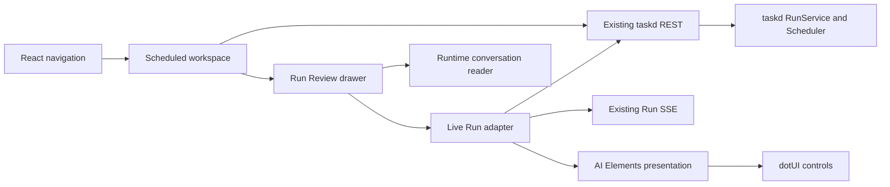

# React Scheduled and AI Elements Design

**Date:** 2026-08-28

**Status:** Approved direction

## Purpose

Move Scheduled Tasks and Run Review into the React Dashboard, then use a controlled subset of Vercel AI Elements for active Codex Live Sessions. The result preserves taskd as the runtime owner, dotUI as the only generic UI system, and the existing privacy boundary around ephemeral conversation content.

## First-principles model

### Goal

Let the user move from a Schedule to its active Run, understand live Agent output, and steer or stop the current Turn from one coherent React surface.

### Facts

- taskd already exposes Schedule, Run, log, Resume, steer, Stop, and Run-specific SSE contracts;
- the Legacy Dashboard proves the end-to-end behavior but owns state through imperative DOM rendering;
- the React Dashboard currently renders only Tasks and disables Scheduled navigation;
- AI Elements provides source-owned React conversation components but its installer assumes shadcn generic primitives;
- this product has standardized generic controls and overlays on dotUI/React Aria;
- live assistant text and activity are ephemeral; SQLite does not store prompt, assistant message, reasoning, tool payload, or intervention text.

### Constraints

- no taskd, SQLite, Runtime Registry, Schedule file, Run API, SSE, Terminal Resume, or privacy-contract changes;
- do not add `@ai-sdk/react`, `useChat`, AI Gateway, or another runtime transport;
- do not install shadcn Button, Tooltip, Select, Dialog, Dropdown Menu, or theme tokens;
- vendor only reviewed AI Elements source required by Live Session;
- generic controls continue to use checked-in dotUI/React Aria components;
- preserve the self-contained `ui/dist/react.html` build with no runtime registry/font/CDN fetch;
- keep Legacy Dashboard operational until React Scheduled parity passes;
- do not add new test files; extend existing React/API tests;
- do not persist live content in localStorage, query persistence, SQLite, logs, or fixtures.

### Success criteria

- React navigation switches between Tasks and Scheduled and persists the view;
- Scheduled supports search, active/paused filtering, Run now, pause/resume, create/edit, and Run Review;
- Run Review displays chronological records, outputs, Session copy/Resume, final message, and bounded logs;
- terminal Run Review reads user/assistant history on demand from the CLI-owned local session without creating a second transcript store;
- an interactive Run renders streaming Markdown through AI Elements, preserves event order, reconnects from its cursor, and exposes steer/Stop with typed errors;
- AI Elements does not replace dotUI primitives or introduce a parallel runtime;
- desktop and narrow desktop Playwright flows pass with Critical 0, High 0 and console error 0;
- full tests, type check, build, offline audit, and documentation scan pass.

## Architecture

| Unit | Owns | Does not own |
| --- | --- | --- |
| `DashboardApp` | selected route and global queries | Schedule/Run state machines |
| `ScheduledView` | Schedule collection, filters, actions, editor/review selection | Run event parsing |
| `RunReviewDrawer` | history/detail selection, logs and Resume | SSE protocol or runtime identity |
| `useLiveRun` | EventSource lifecycle, cursor, reducer, steer/Stop state | rendering or durable transcript |
| runtime conversation reader | on-demand user/assistant projection from the CLI-owned session | transcript persistence or tool/reasoning exposure |
| AI Elements source | scrolling, message structure, streaming Markdown | network, model, persistence, generic overlays |
| dotUI | buttons, inputs, selects, dialogs, drawers, tooltips | agent message semantics |

## Data flow

1. `DashboardApp` reads the persisted view and queries only the selected workspace.
2. A manual Run uses the existing idempotency contract and refreshes its Schedule.
3. Run Review loads Schedule metadata and history; selecting a Run loads authoritative detail.
4. For an interactive `queued` or `running` Run, `useLiveRun` opens the existing Run EventSource.
5. The reducer merges `assistant_delta` by `item_id`, upserts activity by `item_id`, tracks the public `turn_revision`, and reconciles terminal state through a fresh detail request.
6. AI Elements renders messages and scrolling only. Product activity rows stay compact because public events intentionally omit raw tool input/output.
7. The composer submits `{ expected_turn_revision, text }`; Stop submits `{ expected_turn_revision }`. Rejected guidance remains in the local draft.
8. A terminal Run submits only its Run ID; taskd resolves canonical runtime/session facts and the adapter calls the CLI protocol `thread/read` on demand.

## AI Elements boundary

Use reviewed official registry source for:

- `Conversation`, `ConversationContent`, and `ConversationScrollButton`;
- `Message`, `MessageContent`, and `MessageResponse`.

`MessageResponse` keeps Streamdown-based streaming Markdown. Generic Button/Tooltip imports are adapted to repository dotUI components. Branching, attachments, reasoning, download, model picker, AI SDK hooks, and the full official Prompt Input are excluded because the Run contract does not support those semantics.

The composer is a Tasks Recorder component built from React Aria/dotUI. The official Prompt Input is deliberately excluded because its registry pulls shadcn command, dropdown, hover-card, select, spinner, tooltip, attachment, and model-selection primitives that this product does not need.

## Experience

### Scheduled workspace

- compact title/count/Create area and a one-row search/filter toolbar;
- schedules ordered by unread state, enabled state, next run, then title;
- current Run state, next run, cadence, workspace and actions visible without decorative rails;
- mutation errors adjacent to the affected surface.

### Run Review

- dotUI Drawer with compact history and selected detail;
- active interactive Runs prioritize Live Session above terminal facts;
- assistant text is primary; activity is lower contrast;
- completed Runs show CLI-owned conversation history when available, then outputs, logs, Session copy, and Terminal Resume;
- closing restores focus to the invoking Schedule action.

### Live Session

- compact connection state, not an alert banner;
- stick to bottom only while the user is already near the bottom;
- scroll-to-latest control while reviewing older content;
- streaming Markdown supports code, tables, lists, CJK, and incomplete blocks;
- composer never covers the last message;
- `Cmd+Enter` / `Ctrl+Enter` sends; plain Enter creates a newline;
- steer failures stay inside the composer with no toast or optimistic user bubble;
- Stop remains reachable for an active Turn.

## Failure and recovery

| Condition | Behavior |
| --- | --- |
| Schedule API unavailable | scoped retry state; Tasks remains usable |
| EventSource disconnected | Run continues; reconnect from last sequence |
| replay expired | clear partial content and fall back to durable detail/logs |
| Turn changed/not steerable | retain draft and show typed local guidance |
| Run terminal | close stream, fetch authoritative detail, show terminal actions |
| Markdown fragment failure | bounded plain-text fallback instead of broken Review |
| registry unavailable | no effect because selected source is checked in |

## Security and privacy

- the browser sends only semantic IDs, public Turn revision, and bounded guidance;
- no live content is written to localStorage, persistent query cache, SQLite, logs, screenshots, or committed fixtures;
- Run SSE content lives only in component memory and is discarded when the Run/drawer changes;
- terminal history is projected from the CLI-owned local session into request/UI memory only; it is never copied into SQLite, Run logs, localStorage, or persistent query cache;
- AI Elements receives normalized display text and cannot call a model or backend;
- external links keep Streamdown safe defaults and no remote image prefix is added.

## Verification

- existing React tests cover routing, actions, Run Review, reducer ordering, composer state, focus restoration, and typed failures;
- API tests cover every React client method and query/body shape;
- Playwright verifies a real local Schedule at 1440×840 and 1024×768, including Run now, streaming, steer, Stop/terminal convergence, Session Resume, keyboard use, and console output;
- build audit rejects remote registry/font URLs, shadcn/Radix dependencies, and missing Streamdown source scanning;
- Legacy Dashboard regression checks remain until React cutover.

## Johari review

### Open area

- the backend interaction model and privacy boundary already work;
- React/dotUI is the target Dashboard foundation;
- AI Elements is presentation, not runtime ownership.

### Hidden area

- a Tasks Recorder-owned durable transcript or transcript search would still require a separate privacy/storage decision;
- approval UI needs new protocol events and is outside this integration.

### Blind spots

- the full AI Elements installer would silently reintroduce shadcn primitives;
- showing accepted guidance as durable user messages would misrepresent reconnect behavior;
- embedding React messages in Legacy Scheduled would preserve two competing state systems.

### Unknowns and early validation

- pin current registry source/dependencies before copying;
- prove Streamdown in the non-Next single-file build before completing Run Review;
- compare actual Run SSE shapes with the proven Legacy reducer and a real Run;
- run Playwright on the first vertical slice before editor parity.

## Non-goals

- runtime or Scheduler semantic changes;
- durable transcript storage/search;
- Dashboard-native follow-up Turns after completion;
- reasoning/tool payload/approval rendering without public normalized events;
- attachments, citations, branching, model picker, voice, or AI Gateway;
- deleting Legacy Scheduled before parity evidence.
