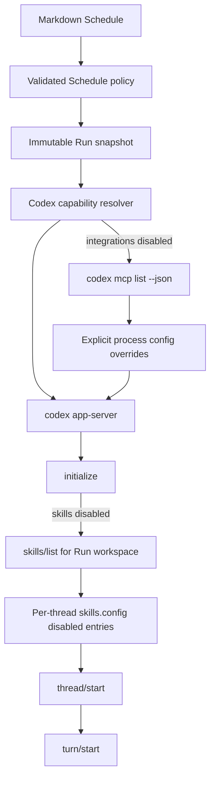

# Schedule Capability Isolation Design

**Date:** 2026-08-31

**Status:** Approved for implementation

**Scope:** Give each Markdown Schedule explicit control over whether Codex Skills and integrations are exposed to its model context, without changing the user's global Codex configuration.

## Summary

Scheduled Runs are independent automation jobs. They should not inherit every interactive Codex extension by accident. A Schedule therefore owns a small capability policy:

```yaml
capabilities:
  skills: disabled
  integrations: disabled
```

`skills` controls Codex Skills. `integrations` controls configured MCP servers, plugin-provided MCP servers, and Apps/Connectors. Web Search, Shell, file tools, and other Codex-native tools are not integrations and remain available. Their operating-system access remains governed by the existing `sandbox` policy.

Existing Markdown definitions without `capabilities` retain the current behavior (`inherit`). Newly created Schedules default both values to `disabled`. The policy is resolved for each Run and stored in its immutable snapshot.

## First-principles model

### Goal

Make an automated Run predictable: the model sees only the extension surfaces the Schedule explicitly allows, while authentication, Session persistence, Web Search, and core Codex tools continue to work normally.

### Facts

- Codex sandboxing controls operating-system access; it does not remove Skills or MCP tool definitions from model context.
- Codex supports per-skill enablement through `skills.config` and per-MCP enablement through `mcp_servers.<id>.enabled`.
- Codex app-server accepts process configuration overrides and `thread/start.config` overrides.
- `codex mcp list --json` returns configured MCP identities without launching an Agent thread.
- An empty `mcp_servers={}` override merges with inherited configuration and does not remove configured servers.
- Tasks Recorder already starts an independent Codex app-server for each active Run.
- Web Search is a native Codex tool and must not be coupled to MCP or Apps policy.

### Constraints

- Never edit `~/.codex/config.toml` or write a persistent Codex profile.
- Never create a second `CODEX_HOME`; Run Sessions must remain resumable through the user's normal Codex installation.
- Never pass browser-provided argv or arbitrary config keys to Codex.
- Capability discovery and launch use argument arrays with `shell: false`, bounded output, and bounded timeouts.
- `disabled` is fail-closed. If Tasks Recorder cannot prove that a requested isolation policy was applied, the Run fails before `thread/start`.
- Existing Schedule definitions remain behavior-compatible.
- Web Search remains outside this feature.

### Success criteria

- A new Schedule persists both capability values as `disabled` unless the user enables them.
- An old definition without `capabilities` parses as `inherit` without changing its file.
- A Run snapshot contains the exact resolved policy used for that occurrence.
- With integrations disabled, the Run app-server starts with every configured MCP identity explicitly disabled and Apps/Connectors disabled.
- With Skills disabled, every discovered Skill path is disabled in `thread/start.config` before the Thread is created.
- With either value inherited, Tasks Recorder does not override that capability family.
- No capability switch disables Web Search or changes sandbox mode.
- Invalid policy values, malformed discovery output, unsafe identifiers, and discovery timeouts produce stable typed Run failures.

## Public Schedule contract

The canonical domain shape is:

```ts
type CapabilityMode = 'inherit' | 'disabled'

interface ScheduleCapabilities {
  skills: CapabilityMode
  integrations: CapabilityMode
}
```

Markdown uses the same nested shape:

```yaml
---
type: tasks-recorder/schedule
id: 4e27a4a7-1528-4cfd-8bd2-e7cb6b6e0fa1
title: Daily report
enabled: true
workspace: /absolute/workspace
agent: codex
schedule:
  kind: daily
  at: 09:00
capabilities:
  skills: disabled
  integrations: disabled
sandbox: workspace-write
timeout: 2h
---
```

Parsing defaults an absent object or absent member to `inherit`. Serialization always writes both members so a newly saved definition is self-describing. REST create/update accepts only the exact nested keys. Schedule list/detail returns the normalized object.

The Run ledger needs no schema migration because `snapshot_json` already stores the complete immutable Schedule. The snapshot must retain `capabilities` unchanged.

## Runtime architecture



### Integration isolation

Before starting the Run app-server, the resolver invokes:

```text
codex mcp list --json --disable plugins -c apps._default.enabled=false
```

It accepts only a bounded JSON array of bounded unique server names. It then constructs trusted argv entries:

```text
--disable plugins
-c apps._default.enabled=false
-c mcp_servers.<server-name>.enabled=false
```

Discovery runs with the same plugin and Apps policy as the real Run. That removes plugin-owned and App-owned MCP entries before enumeration, so only inherited top-level MCP servers receive explicit overrides. The server name is accepted only when it is a Codex bare-key identity made from letters, digits, `_`, and `-`, then passed directly as one argv item. No shell interpolation is used. Codex 0.151.0 does not correctly target an inherited server when a quoted segment is used in a `-c` dotted path, so an identity that cannot be represented safely fails preflight. Plugin Skills are removed by the independent Skill-path policy.

If enumeration fails, times out, exceeds its byte/count limits, or returns an invalid identity, the actual Run app-server is not started.

### Skill isolation

After app-server `initialize`, but before `thread/start`, Tasks Recorder calls:

```json
{
  "method": "skills/list",
  "params": { "cwds": ["<workspace>"], "forceReload": true }
}
```

The response is normalized to a bounded set of absolute Skill paths. `thread/start.config` then contains:

```json
{
  "skills": {
    "config": [
      { "path": "/absolute/path/to/SKILL.md", "enabled": false }
    ]
  },
  "features": {
    "skill_search": false,
    "skill_mcp_dependency_install": false
  }
}
```

This permits filesystem discovery of Skill metadata for policy construction but prevents the resulting Skills from entering the model's available Skill context. It does not mutate persistent Skill configuration.

### Inherited mode

`inherit` produces no override for that capability family. The user's current Codex configuration remains authoritative. Mixed policies are supported; for example, a Schedule can expose Skills while disabling all integrations.

### Runtime support contract

The Codex runtime advertises capability isolation support in its public runtime metadata. A future runtime adapter must explicitly implement a policy family before accepting `disabled`; it must never silently treat an unsupported policy as `inherit`.

## Dashboard interaction

The Schedule editor adds a compact `Context` group under Runtime:

- `Load Skills`
- `Load integrations`

Both controls are switches. Checked maps to `inherit`; unchecked maps to `disabled`. New drafts start unchecked. Existing definitions reflect their normalized values. Supporting copy explains that integrations mean MCP, Apps, and plugin tools, while Web Search and built-in tools remain available.

The controls are disabled with an explicit unavailable explanation if the selected runtime does not advertise the corresponding isolation capability.

## Failure model

Capability preflight failures use stable codes and never expose raw Codex output:

- `RUNTIME_CAPABILITY_DISCOVERY_FAILED`
- `RUNTIME_CAPABILITY_DISCOVERY_TIMEOUT`
- `RUNTIME_CAPABILITY_DISCOVERY_INVALID`
- `RUNTIME_CAPABILITY_POLICY_UNSUPPORTED`

The Run remains durable and transitions from `queued` to `failed`. A failed discovery never falls back to an unisolated Thread.

## Johari review

### Open Area

- The user explicitly wants context isolation, not an operating-system sandbox.
- Skills and integrations are independently controllable.
- Web Search is excluded.
- New Schedules default to the minimal context; old definitions remain compatible.

### Hidden Area

- Individual existing Schedule prompts may rely on a Skill or MCP implicitly. Compatibility is preserved by defaulting missing fields to `inherit`; users can opt those definitions into isolation deliberately.

### Blind Spot

- Treating `mcp_servers={}` as replacement would leave inherited MCP active. The protocol spike disproved that assumption, so the design explicitly enumerates and disables every identity.
- Enumerating MCP before applying the target plugin/app policy produces identities whose transport layer will not exist at launch. Discovery and launch must use the same `plugins=false` and Apps-disabled policy before top-level MCP overrides are generated.
- A temporary `CODEX_HOME` would isolate configuration but break normal Session location and resume semantics.

### Unknown Area

- Future Codex versions may change CLI output or thread config semantics. Tests pin the accepted boundary shape, runtime preflight fails closed, and the public policy remains independent from Codex-specific argv.
